# EVIDENCE REPORT — TUẦN 9

* **Học viên:** Trần Mạnh Cường
* **Repository:** `https://github.com/G-03-XBrain-Phase-2/argocd-sync-waves-cuong`
* **Môi trường thực hành:** Minikube (Docker driver)

---

## PHẦN 1: GITOPS, APP-OF-APPS & SYNC WAVES

### 1. Lab 3: Kiểm tra tính năng Sync & Self-heal (Tự động phục hồi)

* **Nội dung:** Thực hiện kiểm tra tính năng tự phục hồi và chống lệch cấu hình bằng cách:
  1. Chạy lệnh xóa Pod thủ công trên cụm Kubernetes để kiểm tra cơ chế tự phục hồi của ReplicaSet.
  2. Quan sát ArgoCD và cụm Kubernetes tự động khắc phục, thay thế Pod bị xóa bằng một Pod mới gần như ngay lập tức.
  3. Kiểm tra nhật ký sự kiện (Events) trên ArgoCD để xác nhận hoạt động tự phục hồi.

* **MINH CHỨNG HÌNH ẢNH:**
  
  **Ảnh 1: Lệnh xóa Pod thủ công trên cluster**
  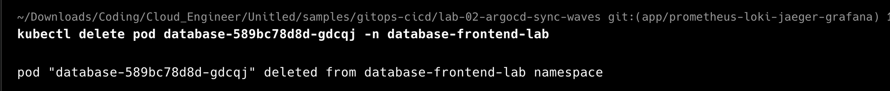
  *(Mô tả: Sử dụng lệnh `kubectl delete pod` để xóa Pod thuộc ứng dụng `sync-waves-app`).*

  **Ảnh 2: Pod mới được tự động tạo lập ngay lập tức**
  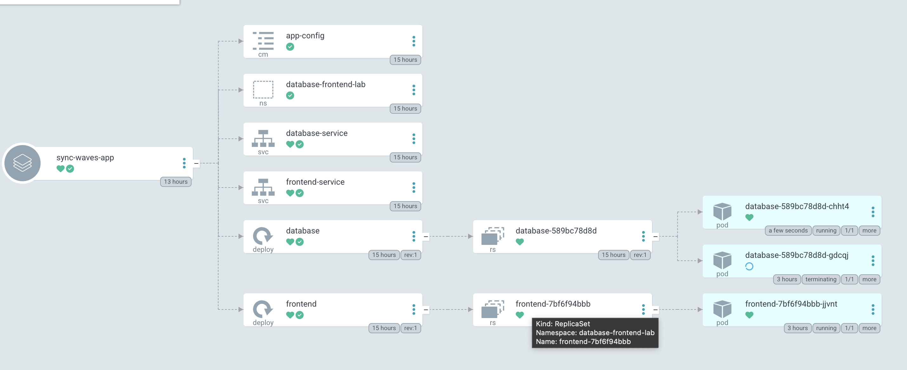
  *(Mô tả: Trong khi Pod cũ `database-589bc78d8d-gdcqj` đang trong trạng thái tắt (Terminating), cụm đã tự động khởi tạo Pod mới thay thế là `database-589bc78d8d-chht4` nhờ cơ chế self-heal).*

  **Ảnh 3: Nhật ký sự kiện ghi nhận đồng bộ thành công**
  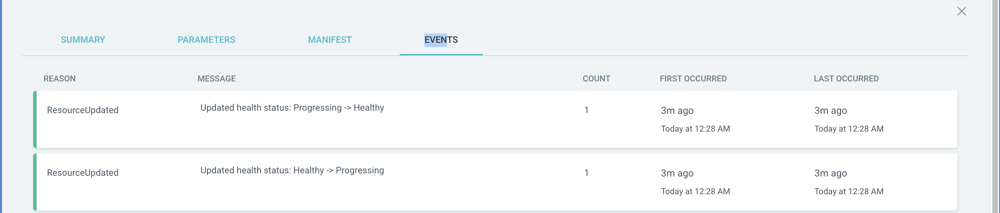
  *(Mô tả: Giao diện ArgoCD Events ghi nhận quá trình đồng bộ và tự động kiểm tra trạng thái tài nguyên hoạt động trơn tru).*

---

### 2. Lab 4: Cơ chế Rollback chuẩn GitOps

* **Nội dung:** Thực hiện rollback (quay lui) phiên bản ứng dụng chuẩn theo GitOps:
  1. Thay vì thao tác trực tiếp trên Kubernetes (lệnh này sẽ bị ArgoCD Self-heal ghi đè), ta chạy lệnh `git revert` để đảo ngược lại các thay đổi lỗi và push lên Git repository.
  2. ArgoCD phát hiện commit revert mới và tự động cập nhật, thu hồi (rollback) các tài nguyên trong cluster về đúng phiên bản mong muốn.

* **MINH CHỨNG HÌNH ẢNH:**

  **Ảnh 1: Lịch sử commit trước khi chạy lệnh revert (Có chứa commit lỗi/thử nghiệm)**
  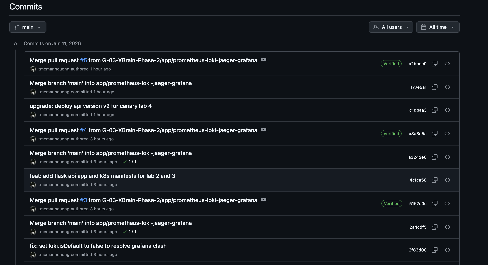
  *(Mô tả: Lịch sử commit trên GitHub trước khi thực hiện rollback).*

  **Ảnh 2: Chạy câu lệnh `git revert` để tạo commit đảo ngược**
  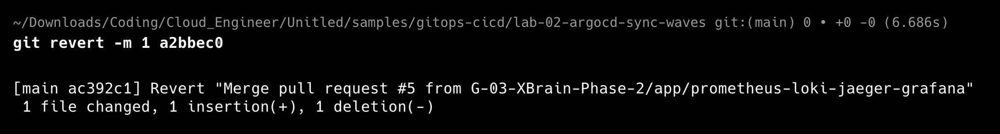
  *(Mô tả: Lệnh `git revert` được chạy thành công trên terminal để tự động tạo commit đảo ngược trạng thái code).*

  **Ảnh 3: Lịch sử commit sau khi revert thành công**
  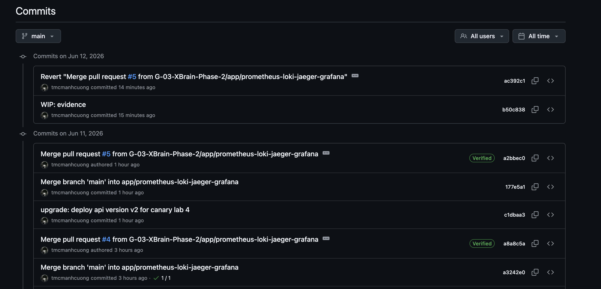
  *(Mô tả: GitHub ghi nhận commit revert mới nhất nằm trên cùng).*

  **Ảnh 4: ArgoCD tự động đồng bộ và rollback về commit mới nhất**
  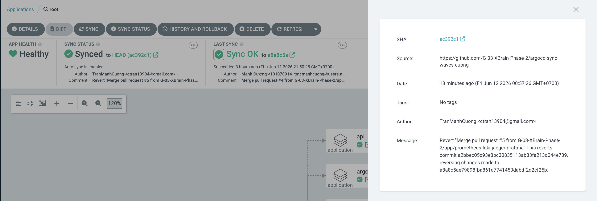
  *(Mô tả: Giao diện ArgoCD hiển thị ứng dụng đã được đồng bộ với commit ID tương ứng của bản revert).*

---

### 3. Lab 5: Mô hình App-of-Apps

* **Nội dung:** Root Application (`root.yaml`) giám sát thư mục `argocd/apps/`. Khi thêm các file cấu hình ứng dụng con vào thư mục này, Root App sẽ tự động quét, phát hiện và tự sinh ra các ứng dụng con tương ứng trên cụm Kubernetes mà không cần tạo thủ công trên UI.

* **MINH CHỨNG HÌNH ẢNH:**

  **Ảnh 1: Cấu trúc mô hình App-of-Apps hiển thị trên ArgoCD UI**
  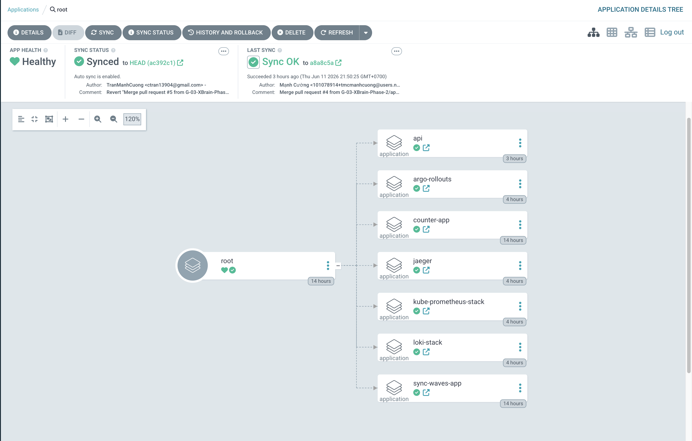
  *(Mô tả: Giao diện chính của ArgoCD hiển thị ứng dụng Root quản lý các ứng dụng con như `sync-waves-app`, `counter-app`, `argo-rollouts`, `kube-prometheus-stack`...).*

---

### 4. Lab 6: Quản lý thứ tự triển khai với Sync Waves

* **Nội dung:** Kiểm soát trình tự chạy resource theo các Wave tương ứng: Namespace (Wave -10), Database/Redis (Wave -5), ConfigMap (Wave -3), và Web App/Frontend (Wave 0). Đã sửa lỗi readinessProbe cho DB (`pgrep sh`) để qua wave thành công.

---

### 5. Lab 7: Thiết lập CI plan-on-PR

* **Nội dung:** Thiết lập luồng kiểm tra (CI) tự động validate các file manifest Kubernetes và ArgoCD bằng Kubeconform trong GitHub Actions mỗi khi có Pull Request (PR) mới được tạo, giúp ngăn chặn lỗi cú pháp trước khi merge vào nhánh chính.

* **MINH CHỨNG HÌNH ẢNH:**

  **Ảnh 1: Kết quả chạy tự động kiểm tra (CI Validation) trên GitHub PR**
  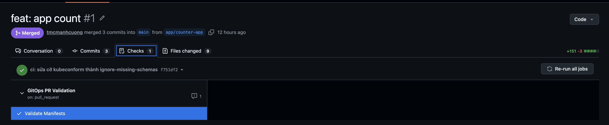
  *(Mô tả: Giao diện Pull Request trên GitHub hiển thị kết quả kiểm tra tự động thành công (tích xanh) của job validate).*

---

## PHẦN 2: OBSERVABILITY & CANARY DELIVERY

### 1. Lab 1: Cài đặt hạ tầng qua GitOps (Prometheus + Argo Rollouts)

* **Nội dung:** Cài đặt bộ giám sát và điều phối Canary thông qua khai báo Git. Sửa lỗi xung đột cấu hình Default Datasource của Loki để chạy thành công.

* **MINH CHỨNG HÌNH ẢNH:**

  **Ảnh 1: Cụm ứng dụng kube-prometheus-stack ở trạng thái Synced & Healthy**
  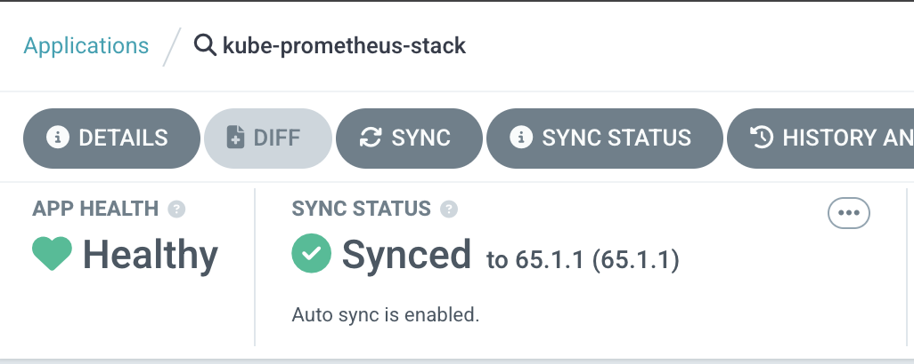
  *(Mô tả: Giao diện ArgoCD hiển thị ứng dụng kube-prometheus-stack đã đồng bộ và chạy tốt).*

  **Ảnh 2: Ứng dụng argo-rollouts ở trạng thái Synced & Healthy**
  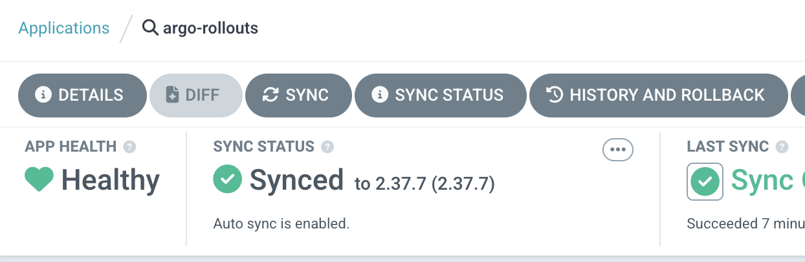
  *(Mô tả: Giao diện ArgoCD hiển thị ứng dụng argo-rollouts sau khi giải quyết xong lỗi CRD OutOfSync đã chuyển sang trạng thái Synced).*

  **Ảnh 3: Trạng thái các Pod chạy trên hệ thống**
  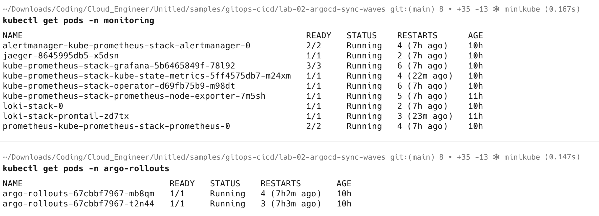
  *(Mô tả: Kết quả chạy lệnh `kubectl get pods -n monitoring` và `kubectl get pods -n argo-rollouts` trên terminal cho thấy toàn bộ các pod của Prometheus, Grafana, Loki, Promtail, Jaeger và Argo Rollout Controller đều đã ở trạng thái Running).*

---

### 2. Lab 2: Viết ứng dụng API Flask có export `/metrics`

* **Nội dung:** Viết code tích hợp `prometheus-flask-exporter` hỗ trợ route `/metrics` và build Docker Image `w9-api:1` nạp vào Minikube.

* **MINH CHỨNG HÌNH ẢNH:**

  **Ảnh 1: Docker Image w9-api đã được nạp thành công vào Minikube**
  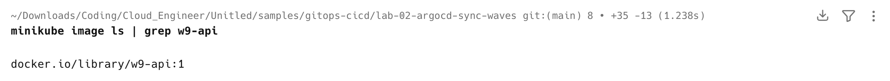
  *(Mô tả: Kết quả chạy lệnh `minikube image ls | grep w9-api` trên terminal cho thấy image `w9-api:1` đã có sẵn trên cụm).*

---

### 3. Lab 3: Triển khai Manifest API dạng Rollout & Xem Metric

* **Nội dung:** Tạo traffic giả lập gửi liên tục vào API. Kiểm tra targets và biểu đồ tăng trưởng request trên Prometheus.

* **MINH CHỨNG HÌNH ẢNH:**

  **Ảnh 1: Cấu hình target demo/api trên Prometheus ở trạng thái UP**
  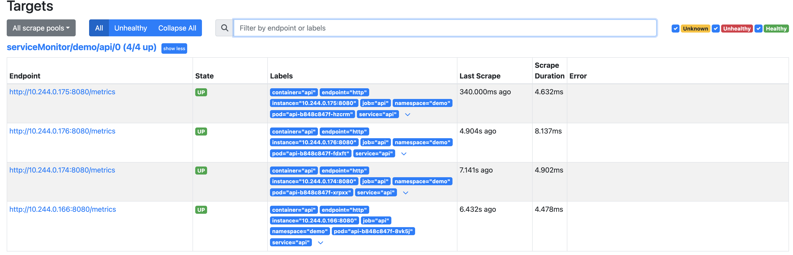
  *(Mô tả: Trang Status, mục Targets trên Prometheus UI hiển thị endpoint `demo/api` đã được scrape thành công).*

  **Ảnh 2: Truy vấn số lượng request (Metrics) trên Prometheus UI**
  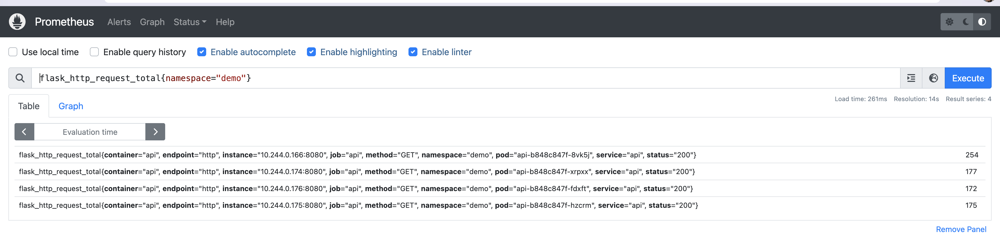
  *(Mô tả: Đồ thị/bảng số liệu lượng request tăng dần khi truy vấn metric `flask_http_request_total{namespace="demo"}`).*

---

### 4. Lab 4: Chạy Canary duyệt thủ công (Manual Canary)

* **Nội dung:** Đẩy phiên bản `v2` của API. Quan sát tiến trình tự động tạm dừng ở mức 25% traffic và tiến hành dùng CLI promote lên 100% thủ công.

* **MINH CHỨNG HÌNH ẢNH:**

  **Ảnh 1: Tiến trình Canary tự động tạm dừng ở mức 25%**
  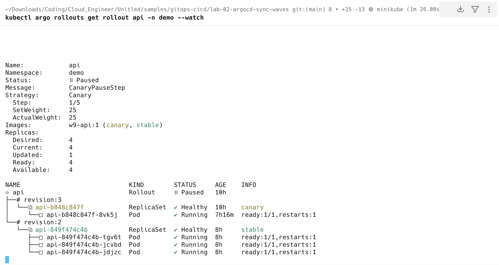
  *(Mô tả: Giao diện terminal chạy lệnh `kubectl argo rollouts get rollout api -n demo --watch` hiển thị trạng thái Paused ở mức 25% traffic để chờ người duyệt).*

  **Ảnh 2: Thực thi lệnh duyệt (Promote) thủ công**
  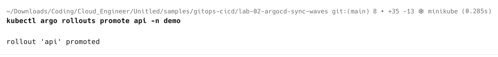
  *(Mô tả: Chạy câu lệnh `kubectl argo rollouts promote api -n demo` để phê duyệt chuyển đổi lên version mới).*

  **Ảnh 3: Tiến trình Canary hoàn tất nâng cấp lên 100%**
  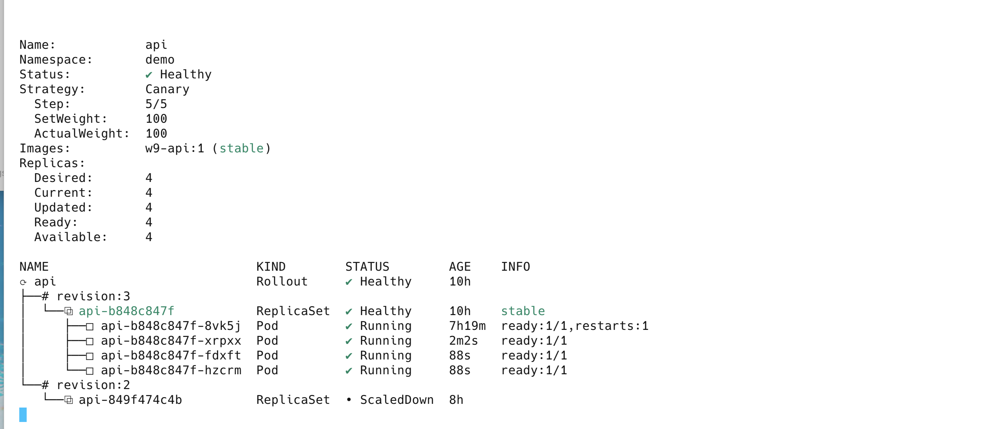
  *(Mô tả: Kết quả sau khi chạy lệnh promote, Rollout tự động tăng traffic và chuyển đổi hoàn toàn 100% các pod sang bản mới `v2`).*

---

## PHẦN 3: THỬ THÁCH LỚN (CHALLENGE: "SHIP SMARTLY")

Phần này ghi nhận kết quả hoàn thiện của hệ thống tự động hoá hoàn toàn quá trình Canary và đo lường cảnh báo lỗi (SLO Alert).

### 1. Trạng thái GitOps đồng bộ (No Drift)

* **Nội dung:** Mọi cấu hình (bao gồm `AnalysisTemplate` và SLO Rules) đều được quản lý qua Git và đồng bộ qua ArgoCD.
* **MINH CHỨNG HÌNH ẢNH:**
  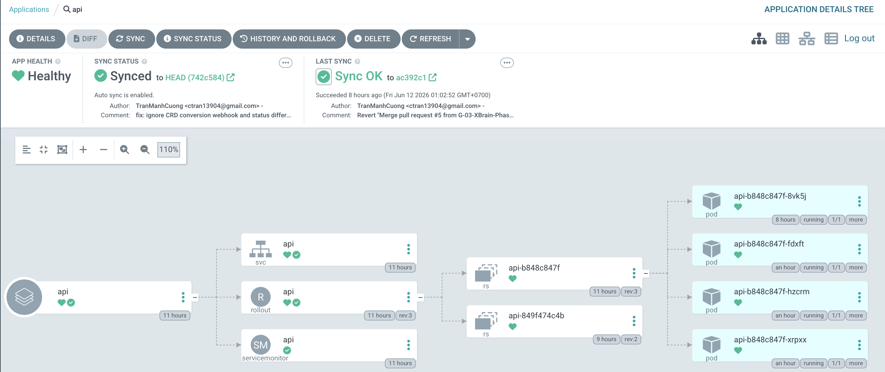
  *(Mô tả: Ảnh chụp giao diện ứng dụng `api` trên ArgoCD hiển thị trạng thái Synced xanh sạch).*

---

### 2. Minh chứng Canary tự động Abort & Rollback (Quan trọng nhất)

* **Nội dung:** Nâng phiên bản mới và cấu hình `ERROR_RATE = 0.1` (tiêm lỗi). Quan sát `AnalysisTemplate` truy vấn Prometheus phát hiện chất lượng lỗi, từ đó tự động kích hoạt hủy bỏ (Abort) và rollback về bản cũ trong vòng dưới 3 phút mà không cần người bấm phím.
* **MINH CHỨNG HÌNH ẢNH HOẶC CLIP:**
  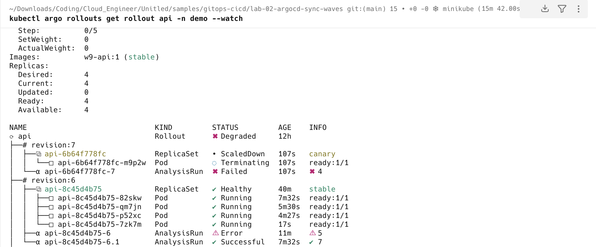
  *(Mô tả: Ảnh chụp lại màn hình terminal CLI watch hiển thị trạng thái `Degraded` / `Aborted` kèm theo lịch sử các lần đo đạc của `AnalysisRun` bị thất bại và tự động chuyển hướng traffic về lại phiên bản cũ).*

---

### 3. Minh chứng Cảnh báo (Alert) gửi về Email cá nhân

* **Nội dung:** Kích hoạt cảnh báo đỏ dựa trên SLO và kiểm tra hòm thư cá nhân.
* **MINH CHỨNG HÌNH ẢNH:**
  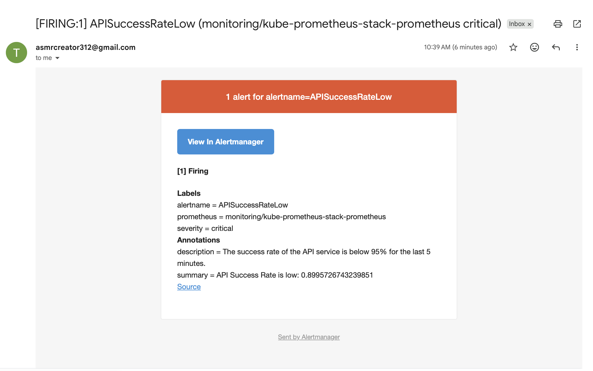
  *(Mô tả: Ảnh chụp lại giao diện Hộp thư email cá nhân hiển thị bức thư thông báo cảnh báo lỗi từ Alertmanager của hệ thống).*

---

### 4. Giải thích chi tiết cấu hình đo lường & ngưỡng (SLO & Alert)

#### a) Ngưỡng đo lường tự động của Canary (AnalysisTemplate)

* **Câu truy vấn PromQL dùng trong AnalysisTemplate:**

  ```promql
  sum(rate(flask_http_request_duration_seconds_count{status!~"5..", pod=~"api-.*"}[2m])) 
  / 
  sum(rate(flask_http_request_duration_seconds_count{pod=~"api-.*"}[2m]))
  ```

* **Giải thích logic & Ngưỡng:**
  * *Ngưỡng đạt:* Tỉ lệ thành công (Success Rate) phải >= 95% (`result >= 0.95`).
  * *Cơ chế đánh giá:* Đo đạc định kỳ mỗi 30s một lần. Nếu kết quả không đạt quá 3 lần (`failureLimit: 3`), hệ thống sẽ lập tức kích hoạt tự động hủy bỏ (Abort) và rollback về phiên bản cũ.

#### b) Cấu hình SLO & Alert cảnh báo

* **Chỉ số đo lường (SLI):** Tỷ lệ các request thành công (không có lỗi 5xx) trên tổng số request HTTP gửi đến dịch vụ API trong vòng 5 phút:
  $$\text{SLI} = \frac{\sum \text{rate}(flask\_http\_request\_duration\_seconds\_count\{status \ne 5xx\})[5m]}{\sum \text{rate}(flask\_http\_request\_duration\_seconds\_count)[5m]}$$
* **Mục tiêu đặt ra (SLO):** Tỷ lệ request thành công phải đạt tối thiểu 95.0% trong khoảng thời gian đánh giá 5 phút.
* **Cú pháp quy tắc Alert (PrometheusRule):**

  ```yaml
  apiVersion: monitoring.coreos.com/v1
  kind: PrometheusRule
  metadata:
    name: api-slo-alerts
    namespace: demo
    labels:
      role: alert-rules
  spec:
    groups:
    - name: api-alerts
      rules:
      - alert: APISuccessRateLow
        expr: |
          sum(rate(flask_http_request_duration_seconds_count{status!~"5..", pod=~"api-.*"}[5m])) 
          / 
          sum(rate(flask_http_request_duration_seconds_count{pod=~"api-.*"}[5m])) < 0.95
        for: 1m
        labels:
          severity: critical
        annotations:
          summary: "API Success Rate is low: {{ $value }}"
          description: "The success rate of the API service is below 95% for the last 5 minutes."
  ```

* **Giải thích hoạt động:** Khi lỗi được inject làm chất lượng tụt dưới ngưỡng SLO, Alert rule chuyển sang trạng thái `Firing`, sau đó Alertmanager tiếp nhận và gửi mail về hòm thư cấu hình sẵn.
